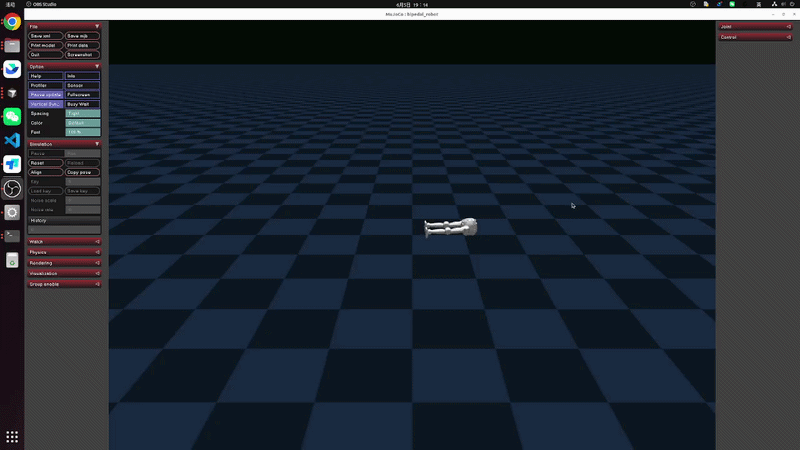
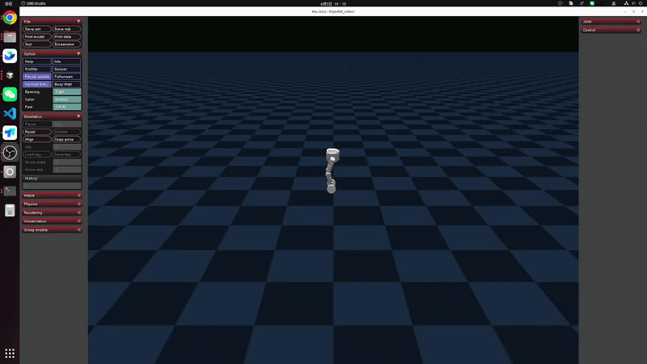
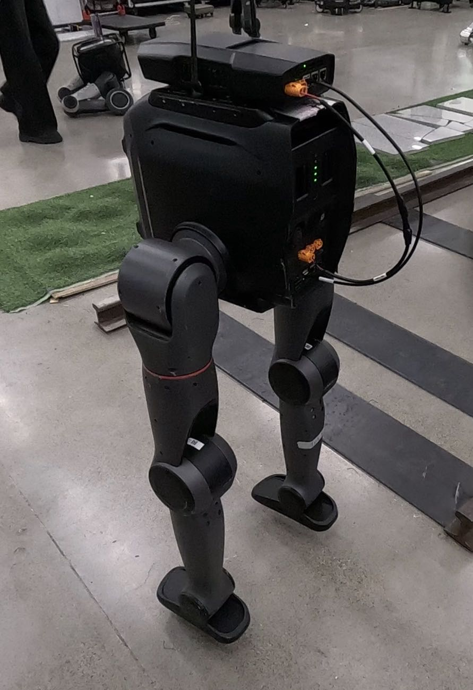

# tron2-mujoco-sim 使用说明

## 1. 运行仿真

### Step 1: 打开终端

### Step 2: 克隆仓库

```bash
git clone --recurse-submodules https://github.com/limxdynamics/tron2-mujoco-sim.git
```

### Step 3: 安装 Python 依赖

```bash
pip install -U pip
pip install mujoco numpy scipy pyyaml onnxruntime pygame
```

### Step 4: 安装 LimX SDK（必须）

根据机器架构安装 SDK wheel（示例）：

```bash
# x86_64
pip install limxsdk-lowlevel/python3/amd64/limxsdk-*-py3-none-any.whl

# aarch64
pip install limxsdk-lowlevel/python3/aarch64/limxsdk-*-py3-none-any.whl
```

### Step 5: 设置机器人型号

当前支持：

- `SF_TRON2A`
- `WF_TRON2A`

示例：

```bash
export ROBOT_TYPE=SF_TRON2A
```

### Step 6: 启动 MuJoCo 仿真器

```bash
cd tron2-mujoco-sim
python3 simulator.py
```

可选：指定 SDK 通信 IP（默认 `127.0.0.1`）：

```bash
python3 simulator.py 127.0.0.1
```

---

## 2. 运行控制器

### Step 1: 打开新终端

### Step 2: 启动 ONNX 控制入口

```bash
cd tron2-rl-deploy-python
export ROBOT_TYPE=SF_TRON2A
python3 main.py
```

可选：指定机器人 IP（和 tron1 用法一致）：

```bash
python3 main.py 10.192.1.2
```

### Step 3: 手柄控制说明

- `L1 + Y`：切换到 WALK
- `L1 + X`：切回 IDLE
- `R1`：清空速度指令
- 打开一个 Bash 终端。

- 运行 robot-joystick：

  ```
  ./robot-joystick/robot-joystick
  ```
---

## 3. 模型文件位置


请将 ONNX 模型按机型放在：

- `tron2-rl-deploy-python/controllers/model/<ROBOT_TYPE>/policy.onnx`
- `tron2-rl-deploy-python/controllers/model/<ROBOT_TYPE>/encoder.onnx`
- `tron2-rl-deploy-python/controllers/model/<ROBOT_TYPE>/params.yaml`

例如：

- `tron2-rl-deploy-python/controller/model/SF_TRON2A/...`
- `tron2-rl-deploy-python/controller/model/WF_TRON2A/...`

---

## 4. 效果展示

### 仿真部署 (Simulation)




### 实机部署 (Real-world)

实机部署时请悬挂启动控制器




## 5. 常见问题

- `ROBOT_TYPE not set`：先执行 `export ROBOT_TYPE=...`
- `Model not found`：检查 `controller/model/<ROBOT_TYPE>/` 下模型文件是否齐全
- `No module named limxsdk`：SDK wheel 未安装到当前 Python 环境
- `RobotState has not been received yet`：通常是仿真器没启动，或仿真与控制器的 `ROBOT_TYPE` 不一致

## 6. License

[Apache 2.0](LICENSE)
